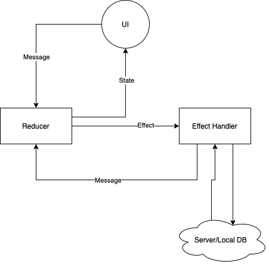

# MVU-Core
Base module for using the MVU architecture

## Installation
So far I'm not going to upload artifacts anywhere, so just download the project and make "publishToMavenLocal"

Add dependencies into `build.gradle`

``` kotlin
    //...
        val commonMain by getting {
            dependencies {
                ...
                implementation("Core:core:1.0.0")
                ...
            }
        }
    //...
```

## Architecture overview
The basic principles of architecture are based on "The Elm Architecture".
The main components of the architecture are:
- state - state of the component, data required to display the correct state of the user interface;
- message - the intention to change the state of the component, can be produced both by the user interface and internal mechanisms;
- effect - intention to perform some work in the background (request to the server, lengthy calculations, etc.);
- reducer - handler of "message" type components;
- effectHandler - handler for "effect" type components.

The interaction of components with each other can be represented as a diagram:
